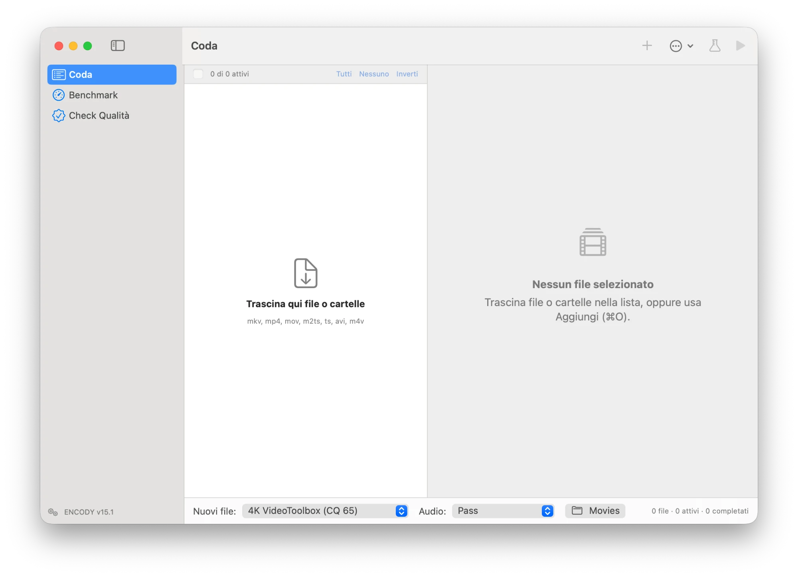

# Encody 🎞️


**Encody** is a native macOS app (SwiftUI + a Go engine driving FFmpeg) to re-encode and remux a video library in batch, keeping HDR10, HDR10+ and Dolby Vision metadata intact and choosing exactly which audio and subtitle tracks to keep.



> Encody 1.0 is the first GUI release of what used to be the **MediaEnc** command-line tool. Settings from the MediaEnc app are migrated automatically on first launch.

## ✨ Features
- **Batch Queue:** Drag & drop files or folders, enable/disable items, reorder, import/export the queue as JSON (the same format as the CLI).
- **Presets:** Remux (copy video), 4K/1080p VideoToolbox, 4K x265 CPU, 4K high bitrate VBR, and two x265 presets for grainy films.
- **Film Grain Detection:** Each file gets a grain index (noise left in the flattest midtone blocks after a high-pass, measured on 15 full-resolution frames). Medium/high grain shows a badge, suggests the grain preset and adds it to the benchmark.
- **HDR Aware:** HDR10, HDR10+, HLG and Dolby Vision detection; dynamic metadata re-injected with `dovi_tool` / `hdr10plus_tool` after a frame-count check; optional real HDR→SDR tonemapping (zscale).
- **Track Selection:** Per-file audio and subtitle choice with suggestions (Italian forced subtitles, default flags), audio modes **Pass**, **E-AC3 Smart** (downmix 7.1→5.1 when needed) and **Stereo AAC**.
- **Auto Crop & Test Mode:** Black-bar detection and a 5-minute test encode before committing to a whole file.
- **Savings Recap:** Size before/after per file and per queue, speed and elapsed time, Dock badge and notifications.
- **Benchmark:** Encode three 15 s samples with several presets and compare quality vs. estimated size on a chart. Samples are picked automatically from the beginning, middle and end of the film by analyzing bitrate and brightness (no black frames, fades or overly dark scenes, intro and credits skipped), with thumbnails and manual override.
- **Quality Check:** Compare any original with its encode using **VMAF**, **XPSNR**, **ColorVideoVDP** or **SSIM**.
- **HDR Quality Metrics:** XPSNR (10-bit, built into FFmpeg) and ColorVideoVDP (perceptual model with a PQ/HLG display, GPU accelerated) instead of the SDR-only VMAF model.
- **CLI Included:** The bundled `encody` engine also works from the Terminal (interactive menu or headless JSON commands).
- **Appearance:** System, Light and Dark themes.

## 🚀 Requirements
- macOS 14 (Sonoma) or later.
- [FFmpeg](https://ffmpeg.org) 7.1+ with `zscale` and `libvmaf` (`brew install ffmpeg`).
- Optional: [MKVToolNix](https://mkvtoolnix.download), `dovi_tool`, `hdr10plus_tool` for dynamic HDR metadata.
- Optional: Python 3.10+ for ColorVideoVDP (installed from **Settings → Install ColorVideoVDP**, about 1 GB with PyTorch).

---

## 📥 Installation

Encody is a private app and is built from source:

```bash
./build_app.sh --install
```

### ⚠️ How to open the app

The app is signed only locally (ad-hoc), not with a paid Apple Developer ID. If macOS blocks the first launch, **right-click** the `Encody` icon, choose **Open**, then **Open** again.

## 🛠 Build from Source

```bash
./build_app.sh            # build/Encody.app with the engine inside the bundle
./build_app.sh --install  # also installs it in /Applications and launches it
```

Requires Go and the Xcode Command Line Tools (Swift 5.9+). During development: `cd app && swift run` (the engine is then looked up in Settings → Engine, `/opt/homebrew/bin`, `/usr/local/bin` or `~/go/bin`). To work in Xcode, open `app/Package.swift`.

The icon source is `icon/AppIcon.svg`; the PNGs in `icon/AppIcon.iconset` are turned into `AppIcon.icns` by the build script.

## 🎞️ Film Grain

Normal presets smooth grain away (the x265 CRF 18 preset kept only 26–52% of the grain of *The Empire Strikes Back*). The grain presets disable SAO, lower deblocking, raise `psy-rd`/`psy-rdoq` and use `aq-mode 3`:

| Preset | Grain kept | Size vs. BDRemux | Speed |
|---|---|---|---|
| x265 Medium CRF 18 (preset 3) | 26–52% | 10–14% | 1× |
| x265 Grain Slow CRF 17 (preset 5) | 75–87% | 41–44% | ~0.4× |
| x265 Grain fast, Medium CRF 17 (preset 6) | 58–81% | 23–27% | ~1× |

`--tune grain` keeps everything but produces files larger than the source. Grain index thresholds: low < 1, medium 1–2, high ≥ 2 (10-bit code values).

## 📏 Quality Metrics

| Metric | Use | Notes |
|---|---|---|
| VMAF | SDR | `vmaf_v0.6.1`, trained on SDR content: on HDR it is only indicative |
| XPSNR | SDR and HDR | FFmpeg filter, works at 10 bit; score = Y:U:V weighted 6:1:1 average in dB |
| ColorVideoVDP | HDR (and SDR) | human-vision model with a PQ/HLG display, the most accurate; analyzes 8 s on the GPU (MPS) |
| SSIM | fast | Quality Check only |

The benchmark picks XPSNR for HDR sources and VMAF for SDR ones (it can be changed). ColorVideoVDP lives in `~/Library/Application Support/Encody/cvvdp`; the engine also looks in `~/.local/bin`, the `PATH` or `ENCODY_CVVDP`.

## ⚙️ Engine Protocol

The app contains no encoding logic: it runs the engine headless and reads its JSON events, so CLI and GUI behave the same way and queue `.json` files are interchangeable.

| Command | Output |
|---|---|
| `encody caps` | version, tools found, zscale/libvmaf/xpsnr/ColorVideoVDP, presets |
| `encody probe <file>` | file info, described tracks, prefilled job |
| `encody crop <file>` | `{"crop": "crop=…"}` |
| `encody plan < queue.json` | per job: video description, audio plan, tonemap/inject constraints, warnings |
| `encody run [--test] <queue.json>` | NDJSON: queue_start, job_start, step, progress, info, job_done, queue_done |
| `encody segments <file>` | NDJSON: step, progress, segments (start, luma, bitrate, thumbnail); cached in `~/Library/Caches/Encody` |
| `encody grain <file>` | `{"index": 2.82, "level": "high", "points": 15}` (cached) |
| `encody thumb --at T <file>` | `{"thumb": "…jpg"}` for a sample starting at T seconds |
| `encody bench --presets 1,3 [--metric auto\|vmaf\|xpsnr\|cvvdp] [--segments t1,t2,t3] <file>` | NDJSON: bench_start, bench_preset_start, progress, bench_result, bench_done |
| `encody quality --metric vmaf\|ssim\|xpsnr\|cvvdp --ref A --dist B` | NDJSON: step, progress, quality_result |

Flags go before positional arguments. SIGINT stops cleanly (temporary and partial files removed). Without arguments the interactive CLI starts.

## 🚧 Roadmap & TODO

* [ ] **English UI:** The interface is Italian only for now.
* [ ] **Custom Presets:** Edit and save encoding presets from the app.
* [x] **HDR Quality Metrics:** XPSNR and ColorVideoVDP.

## Privacy & Security

Everything runs locally on your Mac. Files are only read and written by FFmpeg and the other local tools; nothing is sent over the network (the only download is the optional ColorVideoVDP install from PyPI).

## 🤖 AI Acknowledgment

This application was developed with the assistance of Artificial Intelligence for code generation, logic optimization, and problem-solving.

---

Created with AI, ❤️ and SwiftUI.
